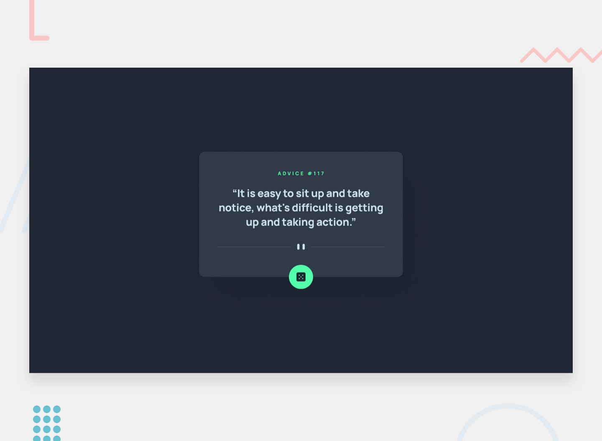

# Advice Generator App

This is a solution to the Advice Generator App challenge on Frontend Mentor.

##  Overview

The Advice Generator App displays random advice fetched from the Advice Slip API.  
Users can generate a new piece of advice by clicking the dice button.

##  Features

- Responsive design for mobile and desktop
- Fetch random advice from API
- Hover effects for interactive elements
- Modern UI design
- Clean and organized code

##  Built With

- HTML5
- CSS3
- Flexbox
- JavaScript
- Advice Slip API

## 📸 Screenshot




##  Folder Structure


```bash
project-folder/
│
├── index.html
├── style.css
├── main.js
├── README.md
└── images/

